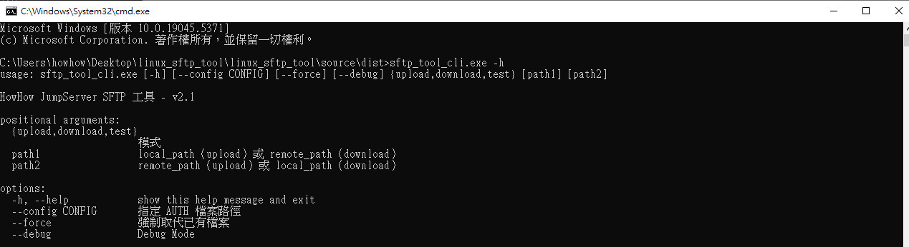
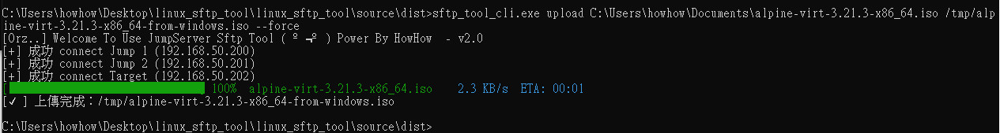
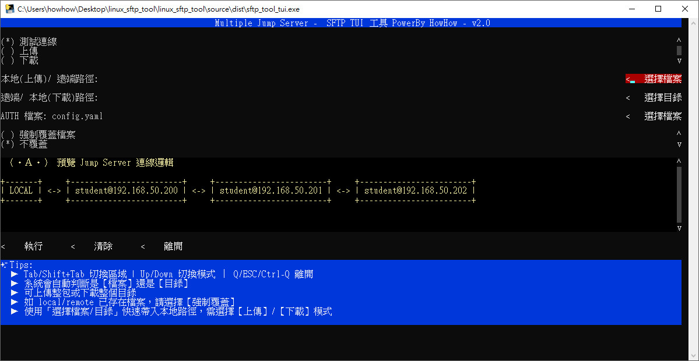
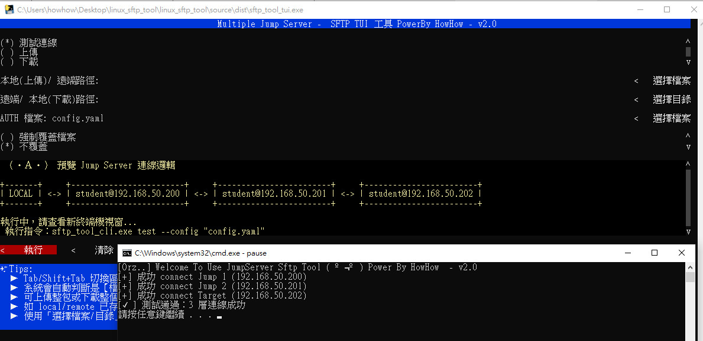
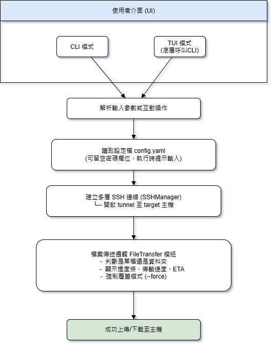

#  HowHow SFTP Tool - 多層 SSH Jump 跨環境傳檔工具

> 為解決 Linux 系統管理員 SCP 傳檔在多跳主機間的痛點，在 Windows 環境下無法使用原生 Linux ssh ( scp ) 工具。

---

## 📌 設計場景

在公司環境中，系統管理員常面對以下情況：

- 使用 **終端機** 進行主機作業( 需跨環境 )
- 需透過 2 層以上 **跳板機 (Jump Server)** 才能連上至目的主機 (防火牆阻絕)
- **WinSCP / Windows SCP 無法處理多跳 SSH**
- 大檔案時必須手動搬移每一層，容易導致 **跳板主機硬碟塞爆 Orz ..**


**HowHow SFTP Tool**  支援下列方式 ：

- ✅ 支援任意層 SSH 跳板機
- ✅ 支援單檔或資料夾遞迴上傳/下載
- ✅ 自動建立 SSH Tunnel，**無需手動複製搬檔**
- ✅ 提供 CLI + TUI 雙模式介面，交互式圖形選擇與自動化
- ✅ 完全自訂 `config.yaml` 設定，**不同環境一鍵切換**

🔐 `config.yaml` (路徑預設目錄，可自行選擇其他符合格式自定義 AUTH 檔案)中的每個主機帳號可填入密碼，也可留空：
- 若留空，程式會在執行時互動式詢問使用者輸入密碼
- 適合多人共用、避免明文密碼保存或有金鑰驗證的情境

---

>Download >>
***[點我下載編譯EXE執行檔~](https://github.com/JeffWen0105/Linux_multi_sftp_tool/releases)***


## ⚙️ 執行方式

### CLI 使用範例：
```bash
sftp_tool_cli.exe upload ./local/file.txt /remote/path --config config.yaml --force
sftp_tool_cli.exe download /remote/file.txt ./local/ --config config.yaml
sftp_tool_cli.exe test --config config.yaml
```

### TUI 使用方式：
```bash
sftp_tool_tui.exe
```

***囿於 TUI 是將 Python 所有依賴套件壓縮打包成一個 exe 執行檔(如果windows 沒有安裝pyhton直譯器會更久)，第一次載入時解開需要時間 .....***


- `Tab/Shift+Tab` 切換區域
- 方向鍵上下切換模式
- `Q` / `ESC` 離開
- 使用者可切換模式 / 編輯路徑 / 設定 `config.yaml`

---

## 📣 Demo Screenshots

### CLI 操作



### 上傳檔案



### TUI 操作



### TUI 測試連線



---

## 📝 邏輯流程圖


	



---

## 📂 Python Source 專案結構與原始碼說明

```
├── sftp_tool.py           # 主程式 (CLI 入口點)
├── tui.py                 # 圖形終端 (TUI 介面)
├── ssh_manager.py         # 多層 Jump SSH 管理邏輯
├── file_transfer.py       # 上傳/下載檔案或目錄的核心邏輯
├── config_manager.py      # 設定檔 (YAML) 載入與驗證
├── connection_tester.py   # 測試多層 SSH 是否可連線
├── utils.py               # Log 設定、共用工具
├── visual_helper.py       # ASCII 圖視覺化 Jump 結構
├── config.yaml            # 範例設定檔 (用戶需填入帳號/密碼)
```

---

## 🛡️ 模組功能說明

### `sftp_tool.py`
- CLI 入口
- 參數：`upload` / `download` / `test` 模式
- 判斷路徑是檔案還是目錄
- 使用 `--force` 覆蓋既有檔案、`--debug` 顯示詳細資訊 ( 僅 CLI 具備 )

### `tui.py`
- 可視化互動工具
- 使用 prompt_toolkit 套件的 TUI 界面

### `ssh_manager.py`
- 解析 `config.yaml` 並建立跳板 SSH Jump Chain
- 密碼自動帶入登入
- 若密碼欄位留空，將於執行時提示輸入密碼

### `file_transfer.py`
- 執行上傳與下載任務（目錄遞迴處理）
- 顯示傳輸進度、速度、ETA 時間

### `config_manager.py`
- 載入與驗證 YAML 格式
- 檔案不存在時會自動產生初始 Example

### `connection_tester.py`
- 測試多層 Jump Server 到 Target 連線
- 顯示成功層數與失敗節點

### `visual_helper.py`
- TUI 專用：產生 Jump 結構圖


## 打包為 Windows EXE（使用 PyInstaller）

```bash
pyinstaller  --noconfirm --onefile --console --noupx --clean sftp_tool.py
pyinstaller  --noconfirm --onefile --console --noupx --clean tui.py
```


---

## 📣 歡迎同仁使用、回饋與共創

此工具在降低跨主機傳檔的痛苦，歡迎大家一起來使用、改進與擴充！

